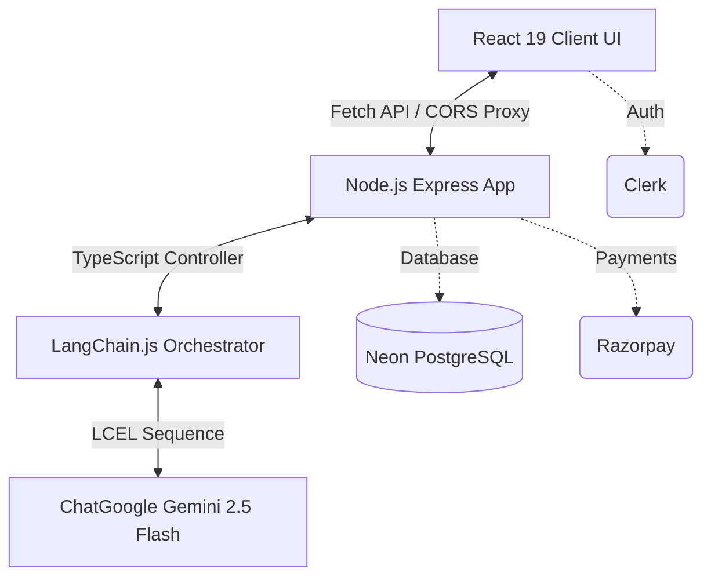

<div align="center">

# 📈 InvestIQ AI 
**Your Personal Institutional-Grade AI Investment Analyst**

[](https://reactjs.org/)
[](https://www.typescriptlang.org/)
[](https://vitejs.dev/)
[](https://nodejs.org/)
[](https://expressjs.com/)
[](https://ai.google.dev/)
[](https://js.langchain.com/)

*Built on **Swiss International Typographic Design Principles**. No glassmorphism, no gradients, no shadows. Just pure, clean data visualization.*


</div>

---

## 🌟 Overview

**InvestIQ AI** is a production-ready, full-stack AI investment agent. Feed in any company name or ticker, and the LangChain-powered engine executes a structured, multi-step pipeline query to Google Gemini 2.5 Flash. 

It instantly returns:
- 📊 **Comprehensive Research Reports**
- 🎯 **Dynamic SWOT Matrices**
- 🕸️ **Custom SVG Radar Metrics & Solvency Gauges**
- ✅ **Definitive INVEST or PASS decisions**

> *"Democratizing institutional-level equity research through generative AI."*

---

## ✨ Features at a Glance

| Feature | Description |
| :--- | :--- |
| 🤖 **Global AI Chatbot** | A persistent, floating AI assistant available on every page. Ask follow-up questions about market trends or specific stocks! |
| 🔄 **API Key Rotation System** | Robust backend load balancing across up to 5 Google Gemini API keys to bypass rate limits and ensure 100% uptime. |
| 🎟️ **Premium Onboarding Tour** | A Notion-style interactive guided product tour for first-time users. |
| 🔐 **Clerk Authentication** | Secure user management, sign-ups, and session tokens powered by Clerk. |
| 💳 **Razorpay Integration** | Built-in payment gateways for premium subscriptions or one-off analysis credits. |
| 🔗 **Shareable Reports** | Generate unique public URLs for any financial report to share with colleagues or clients. |
| 🎨 **Strict Swiss Typography** | High-contrast, mathematically precise UI grids using Inter font and strict B/W/Red palettes. |

---

## 📸 Platform Gallery

<div align="center">
  
### The Research Dashboard


### SWOT Analysis & Radar Gauges


### Global AI Chat Assistant


</div>

---

## 🏗️ System Architecture

InvestIQ AI uses a clean, decoupled full-stack architecture:



1. **Client**: A high-contrast React 19 layout utilizing responsive structures, local cache management, custom SVG drawing, and Framer Motion animations.
2. **Backend**: Node.js + Express server managing credentials, API key rotation, payments, and database saving.
3. **Cognitive Orchestrator**: LangChain.js configures system prompts and enforces Zod structured JSON parsing.
4. **LLM Engine**: Google Gemini 2.5 Flash executes advanced financial reasoning.

---

## 🚀 Quick Start Guide

### 1. Pre-requisites
Ensure you have [Node.js](https://nodejs.org/) (v18+) and `npm` installed.

### 2. Clone and Install Dependencies
```bash
# Install root, backend, and frontend dependencies concurrently
npm run install:all
```

### 3. Environment Variables
Create a `.env` file in your `backend/` directory:
```env
PORT=5000
NODE_ENV=development

# Database & Auth
DATABASE_URL="postgresql://..."
CLERK_PUBLISHABLE_KEY=your_clerk_key
CLERK_SECRET_KEY=your_clerk_secret

# Payments
RAZORPAY_KEY_ID="rzp_test_xxx"
RAZORPAY_KEY_SECRET="xxx"

# AI Load Balancing (Add up to 5 keys to bypass rate limits!)
GOOGLE_API_KEY=key_1
GOOGLE_API_KEY_2=key_2
GOOGLE_API_KEY_3=key_3
```

Create a `.env` file in your `frontend/` directory:
```env
VITE_CLERK_PUBLISHABLE_KEY=your_clerk_publishable_key
VITE_RAZORPAY_KEY_ID=your_razorpay_key
VITE_API_URL=http://localhost:5000 # (Change this to your deployed backend URL in production)
```

### 4. Run Development Servers
Spin up both the React client server and the Node.js API server simultaneously:
```bash
npm run dev
```

---

## 🧠 How the AI Pipeline Works

Our application bypasses standard API calls in favor of a structured **LangChain Expression Language (LCEL)** pipeline:

1. **Structured Schema**: `ResearchReportSchema` is strictly defined in Zod.
2. **Model Bindings**: We initialize `ChatGoogle` and attach the schema using `.withStructuredOutput()`.
3. **Prompting**: System directs the agent to act as an objective Wall Street analyst and compile structured JSON data without hallucinations.
4. **Execution**: The chain invokes Gemini, validates the output against the Zod schema, and returns strongly typed TypeScript data directly to the React frontend.

---

## 🤝 Contributing

Contributions, issues, and feature requests are welcome!
Feel free to check [issues page](https://github.com/Kishan-Guptaa/InvestAi/issues).

---

<div align="center">
  <p>© 2026 InvestIQ AI. Built with ❤️ and precision.</p>
</div>
