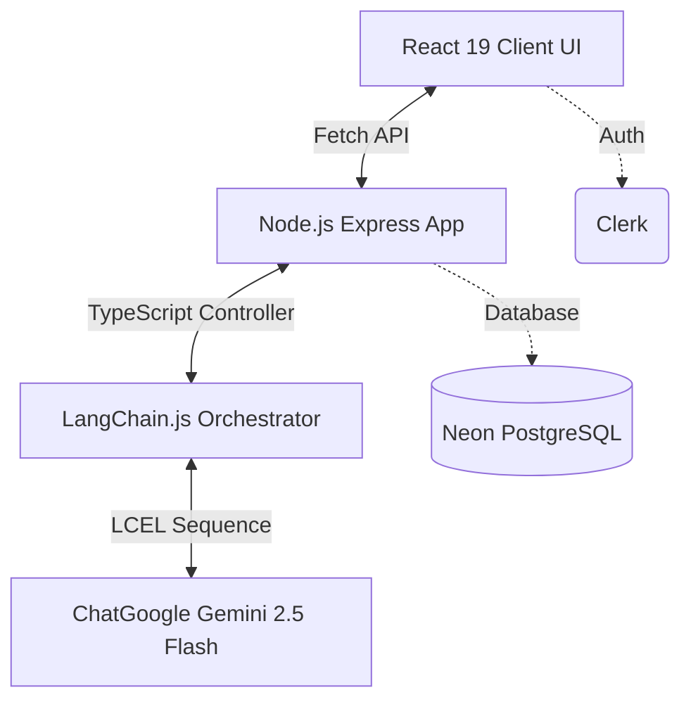

<div align="center">

# 📈 InvestIQ AI 
**Your Personal Institutional-Grade AI Investment Analyst**

[](https://reactjs.org/)
[](https://www.typescriptlang.org/)
[](https://vitejs.dev/)
[](https://nodejs.org/)
[](https://expressjs.com/)
[](https://ai.google.dev/)
[](https://js.langchain.com/)

</div>

---

## 🌟 Overview — What it does

**InvestIQ AI** is a production-ready, full-stack AI investment agent. Feed in any company name or ticker, and the LangChain-powered engine executes a structured, multi-step pipeline query to Google Gemini 2.5 Flash. 

It instantly returns:
- 📊 **Comprehensive Research Reports**
- 🎯 **Dynamic SWOT Matrices**
- 🕸️ **Custom SVG Radar Metrics & Solvency Gauges**
- ✅ **Definitive INVEST or PASS decisions**
- 🤖 **Global AI Chatbot** for follow-up market questions on any page

---

## 🚀 How to run it

### 1. Pre-requisites
Ensure you have [Node.js](https://nodejs.org/) (v18+) and `npm` installed.

### 2. Clone and Install Dependencies
```bash
# Install root, backend, and frontend dependencies concurrently
npm run install:all
```

### 3. Environment Variables
Create a `.env` file in your `backend/` directory:
```env
PORT=5000
NODE_ENV=development

# Database & Auth
DATABASE_URL="postgresql://<your-neon-db-url>"
CLERK_PUBLISHABLE_KEY=pk_test_...
CLERK_SECRET_KEY=sk_test_...

# Payments
RAZORPAY_KEY_ID="rzp_test_..."
RAZORPAY_KEY_SECRET="..."

# AI Load Balancing (Add up to 5 keys to bypass rate limits!)
GOOGLE_API_KEY=key_1
GOOGLE_API_KEY_2=key_2
GOOGLE_API_KEY_3=key_3
```

Create a `.env` file in your `frontend/` directory:
```env
VITE_CLERK_PUBLISHABLE_KEY=pk_test_...
VITE_RAZORPAY_KEY_ID=rzp_test_...
VITE_API_URL=http://localhost:5000 # (Change to deployed backend URL in production)
```

### 4. Run Development Servers
Spin up both the React client server and the Node.js API server simultaneously:
```bash
npm run dev
```

---

## 🧠 How it works — Approach and Architecture

InvestIQ AI uses a clean, decoupled full-stack architecture built to enforce structured LLM outputs:



Our application bypasses standard loose API calls in favor of a structured **LangChain Expression Language (LCEL)** pipeline:
1. **Structured Schema**: `ResearchReportSchema` is strictly defined in Zod.
2. **Model Bindings**: We initialize `ChatGoogle` and attach the schema using `.withStructuredOutput()`.
3. **Execution**: The chain invokes Gemini, validates the output against the Zod schema, and returns strongly typed TypeScript data directly to the React frontend, ensuring zero hallucinated JSON structures.

---

## ⚖️ Key Decisions & Trade-offs

1. **Google Gemini 2.5 Flash over GPT-4o**: Chosen for its massive context window and significantly faster structured output generation time, which is critical for a real-time UI.
2. **Zod + LangChain Structured Output**: Instead of relying on prompt engineering to return JSON (which often breaks), we enforce strict schema validation at the LangChain execution level. If the LLM breaks the schema, it fails loudly on the backend rather than crashing the client.
3. **API Key Rotation**: Free-tier API keys often hit 429 Rate Limits. Instead of forcing users to upgrade, I built a custom `ApiKeyManager` that automatically load-balances requests across an array of up to 5 fallback keys.
4. **Vite SPA over Next.js SSR**: Chosen for speed of development and easier deployment of a purely client-side application. The trade-off is SEO, but since this is an authenticated dashboard tool, SEO was intentionally left out.

---

## 📊 Example Runs

Here is what the agent returns when analyzing **NVIDIA (NVDA)**:
- **Verdict**: `INVEST` (Score: 92/100)
- **Pros**: CUDA software developer ecosystem moat, Unprecedented free cash flow conversions.
- **Cons**: High baseline valuations assume constant hypergrowth, TSMC supply chain dependency.
- **SWOT**: 
  - *Strength*: Undisputed AI accelerator standard.
  - *Threat*: Hyperscaler in-house custom chips (Google TPU, AWS Trainium).

Here is what the agent returns when analyzing **GameStop (GME)**:
- **Verdict**: `PASS` (Score: 35/100)
- **Pros**: Cult-like retail investor backing, massive cash reserves from recent stock offerings.
- **Cons**: Declining core physical game sales, lack of clear pivot strategy, highly volatile meme-stock pricing detached from fundamentals.

---

## 🔮 What I would improve with more time

1. **RAG Pipeline integration**: Allow the agent to scrape the SEC Edgar database for the most recent 10-K and 10-Q filings, embedding them into a Vector Database to ground the financial analysis on the absolute latest earnings call transcripts.
2. **WebSocket Real-time streaming**: Stream the LangChain tokens back to the client so the user can read the report as it is being generated, rather than waiting 5-10 seconds for the final JSON payload.
3. **Portfolio Tracking**: Allow users to construct a mock portfolio based on the AI's recommendations and track its performance against the S&P 500 over time.

---

## 🤖 LLM Chat Logs (Bonus)

All development AI chat session transcripts and logs have been included in the `llm_logs/` directory in this repository to demonstrate the thought process and iterative approach used during development.

---
<div align="center">
  <p>© 2026 InvestIQ AI. Built with ❤️ and precision.</p>
</div>
