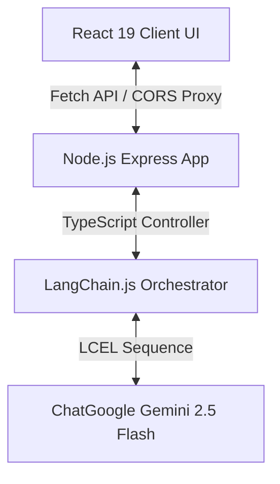

# InvestIQ AI ⚖️🇨🇭

> AI-powered investment research agent for intelligent investment decisions.

InvestIQ AI is a production-ready, institutional-grade AI investment analyst that evaluates public equities and private firms. Built on **Swiss International Typographic Design Principles**, it uses strong grids, high-contrast typography, strict layout structures, flat interfaces (no glassmorphism, gradients, or shadows), and a color palette restricted strictly to Black, White, and Swiss Red.

Feed in a company name, and the agent executes a structured, multi-step LangChain pipeline query to Google Gemini 2.5 Flash. It returns a comprehensive research report, a dynamic SWOT matrix, custom SVG radar metrics charts, solvency gauges, pros vs. cons lists, and a definitive **INVEST** or **PASS** decision.

---

## 🏗️ System Architecture

InvestIQ AI uses a clean, decoupled full-stack architecture:



1. **Client (React 19 + TypeScript + Vite + Tailwind + Framer Motion)**: A high-contrast, typographic layout utilizing responsive structures, local cache management for query histories, custom vector PDF compilation, and SVG drawing gauges.
2. **Backend Server (Node.js + Express + TypeScript)**: Validates input requests, manages credentials, handles API key injections, and captures rate limits or safety exceptions.
3. **Cognitive Orchestrator (LangChain.js)**: Configures system prompts, manages the `RunnableSequence` execution path, integrates `ChatGoogle`, and enforces the Zod structured JSON parser.
4. **LLM Engine (Google Gemini 2.5 Flash)**: Executes the advanced financial reasoning, safety filters, and structured JSON outputs.

---

## 📂 Project Structure

```
/d:/IIM assignmnet/
  ├── backend/                     # Node.js Express API
  │   ├── src/
  │   │   ├── config/              # Env variable loading and validations
  │   │   ├── langchain/           # Zod schemas, prompt templates, and ChatGoogle chains
  │   │   ├── services/            # Services invoking LangChain pipelines
  │   │   ├── controllers/         # Express controllers parsing and routing payloads
  │   │   ├── routes/              # Express API endpoints
  │   │   ├── middlewares/         # Global error mapping (safety filters, invalid keys)
  │   │   └── app.ts               # Express bootloader and server listeners
  │   ├── tsconfig.json
  │   └── package.json
  ├── frontend/                    # React 19 Client App
  │   ├── src/
  │   │   ├── assets/              # Graphic background patterns
  │   │   ├── components/          # Reusable Swiss components
  │   │   │   ├── layout/          # Header, Footer, responsive Grid containers
  │   │   │   ├── ui/              # Buttons, inputs, badges, progress meters
  │   │   │   ├── cards/           # SWOT card, overview profiles, verdict cards
  │   │   │   └── charts/          # SVG radar metrics, segmented gauges, slide scales
  │   │   │   └── sections/        # Loading gates, active dashboard views, features list
  │   │   ├── hooks/               # useLocalStorage state managers, useAnalysis flow
  │   │   ├── services/            # API call proxies
  │   │   ├── utils/               # Time/ticker formatting, print-document builders
  │   │   ├── types/               # TypeScript interface schemas
  │   │   ├── index.css            # Custom base rules, gridlines, scrollbar designs
  │   │   ├── main.tsx             # Root react mounting
  │   │   └── App.tsx              # Component states and routing gates
  │   ├── tailwind.config.js
  │   ├── postcss.config.js
  │   ├── tsconfig.json
  │   └── package.json
  ├── package.json                 # Monorepo workspace manager
  └── README.md
```

---

## 🛠️ Tech Stack

*   **Frontend**: React 19, Vite, Tailwind CSS, TypeScript, Framer Motion, Lucide React.
*   **Backend**: Node.js, Express, TypeScript.
*   **Cognitive Engine**: LangChain.js (`@langchain/core`, `@langchain/google`), Zod schemas.
*   **LLM Model**: Google Gemini 2.5 Flash (`gemini-2.5-flash`).

---

## 🚀 Running Locally

Follow these quick commands to spin up the local development monorepo:

### 1. Pre-requisites
Ensure you have [Node.js](https://nodejs.org/) (v18+) and `npm` installed.

### 2. Clone and Install Dependencies
Install all package dependencies for the monorepo, backend, and frontend at once using the root package manager:
```bash
# Install root, backend, and frontend dependencies concurrently
npm run install:all
```

### 3. Environment Variables
Create a `.env` file in your `backend/` directory based on the `.env.example` template:
```env
PORT=5000
GOOGLE_API_KEY=your_google_gemini_api_key_here
NODE_ENV=development

# Neon PostgreSQL Database
DATABASE_URL="postgresql://..."

# Clerk Authentication Settings
CLERK_PUBLISHABLE_KEY=your_clerk_publishable_key
CLERK_SECRET_KEY=your_clerk_secret_key
VITE_CLERK_PUBLISHABLE_KEY=your_clerk_publishable_key (for frontend)
```

*Note: If you do not have a global backend `GOOGLE_API_KEY`, you can also paste your key dynamically directly in the frontend's **Credentials** modal in the top navigation bar. It will save securely to your local browser storage.*

### 4. Run Development Servers
Spin up both the React client server (`http://localhost:3000`) and the Node.js API server (`http://localhost:5000`) simultaneously:
```bash
npm run dev
```

### 5. Production Compilation
Build both frontend and backend bundles for production deployment:
```bash
npm run build
```

---

## 🛡️ API Endpoints

### `POST /api/analyze`
Submits a company search and initiates the LangChain Gemini pipeline audit.

*   **Headers**:
    *   `Content-Type: application/json`
    *   `x-google-api-key: <optional_override_key>` (Optional header to override the backend's key)
*   **Body**:
    ```json
    {
      "company": "NVIDIA"
    }
    ```
*   **Success Response (`200 OK`)**:
    ```json
    {
      "status": "success",
      "data": {
        "overview": {
          "companyName": "NVIDIA Corporation",
          "ticker": "NVDA",
          "description": "NVIDIA Corporation designs graphics processing units...",
          "industry": "Semiconductors",
          "marketCap": "$3.1T",
          "businessModel": "License and sales of graphics processing units...",
          "competitiveAdvantages": ["CUDA software ecosystem ecosystem moat", "Hardware architecture lead"]
        },
        "financials": {
          "revenueTrend": "Hyper-growth driven by AI data centers scaling...",
          "growth": "+200% YoY data center revenue expansion",
          "profitability": "Exceptional operating margins exceeding 60%...",
          "debt": "Negligible long term debt, robust interest coverage",
          "cashFlow": "Free cash flow yields exceeding 40% allocations..."
        },
        "swot": {
          "strengths": ["CUDA Dominance", "AI accelerator standard"],
          "weaknesses": ["Gross margin dependency on TSMC supply lines"],
          "opportunities": ["Custom enterprise ASICs", "Automotive robotics adoption"],
          "threats": ["Hyperscaler in-house chips, AMD hardware scaling"]
        },
        "risks": {
          "level": "Medium",
          "details": [
            {
              "category": "Customer Concentration",
              "description": "Top 4 cloud providers constitute ~40% of data center segment..."
            }
          ]
        },
        "recommendation": {
          "action": "INVEST",
          "confidenceScore": 88,
          "investmentScore": 92,
          "reasoning": "NVIDIA exhibits an impregnable economic moat...",
          "pros": ["CUDA software developer loyalty locks in enterprise", "Unprecedented free cash flow conversions"],
          "cons": ["High baseline valuations assume constant hypergrowth"],
          "finalSummary": "NVIDIA represents a core technology structural hold..."
        }
      }
    }
    ```

*   **Error Responses**:
    *   `400 Bad Request` (`EMPTY_INPUT`): Empty or null query parameter.
    *   `400 Bad Request` (`MISSING_API_KEY`): No key found in `.env` or header overrides.
    *   `500 Internal Server` (`INVALID_API_KEY`): The API key passed was rejected by Google AI servers.
    *   `500 Internal Server` (`RATE_LIMIT_EXCEEDED`): Limit exceeded.
    *   `500 Internal Server` (`SAFETY_POLICY_VIOLATION`): Query blocked by safety triggers.
    *   `500 Internal Server` (`NETWORK_FAILURE`): Gemini servers inaccessible.

---

## ⚡ How LangChain Works

Our application bypasses direct controller-to-LLM bindings in favor of a structured **LangChain Expression Language (LCEL)** pipeline:

1. **Structured Schema**: `ResearchReportSchema` is defined in Zod.
2. **Model Bindings**: We initialize `ChatGoogle` and attach the schema using `.withStructuredOutput(ResearchReportSchema)`.
3. **Chat Prompts**: We construct a `ChatPromptTemplate` incorporating:
   *   `SystemMessage`: Instructs the agent to act as an objective Wall Street research analyst, stick to public record facts, check for hallucinations, and compile structured JSON data.
   *   `HumanMessage`: Directs the agent to perform the audit on the input `{company}` token.
4. **Runnable Sequence**: We pipe the components together using the pipe operator:
   ```typescript
   const chain = prompt.pipe(structuredModel);
   ```
5. **Execution**: The service invokes the chain, which automatically formats inputs, triggers Gemini 2.5 Flash, validates/parses the incoming text into JSON matching our schema, and returns the strongly typed TypeScript output.
